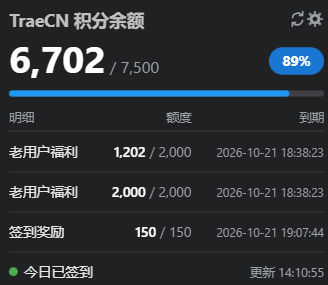

# TraeCN Quota

[English](README.en.md) | [简体中文](README.md)

在状态栏实时显示 Trae CN 账号的积分余额与套餐明细。

## 安装

在当前所用编辑器的扩展市场搜索 **TraeCN Quota**。

也可从 [Releases](https://github.com/GhostCmdr/traecn-quota/releases/latest) 取 `.vsix` 自行安装。

## 功能

- 状态栏显示剩余积分与占比，点击立即刷新
- 悬浮积分卡片：进度条、百分比、按到期时间排序的套餐明细、今日签到状态
- 定时自动刷新
- 每天自动签到，也可点状态栏图标手动补签
- 卡片右上角图标直达用量明细

## 前提

仅支持 Trae CN 国内版账号。凭证二选一：

1. 已登录的 Trae CN / TRAE SOLO CN 桌面客户端，自动读取
2. 设置项 `traecnquota.manualToken`（以手动输入为第一优先）：登录 [trae.cn](https://www.trae.cn) → F12 → 本地存储 → 复制 `Cloud-IDE-Token` 的值

两者都拿不到时状态栏提示「未找到登录态」。

## 设置

| 设置 | 默认 | 说明 |
|---|---|---|
| `traecnquota.refreshInterval` | `30` | 自动刷新间隔（分钟），`0` 关闭 |
| `traecnquota.detailRows` | `3` | 积分包显示条数，可调 `2` ~ `5` |
| `traecnquota.autoCheckin` | `true` | 每天自动领一次签到积分 |
| `traecnquota.edition` | `auto` | 读取哪个国内版客户端的登录态 |
| `traecnquota.manualToken` | 空 | 手动 accessToken，填一次即收进保管箱并清空 |
| `traecnquota.hostOverride` | 空 | 调试用，只接受默认端口上的 `https://api.trae.cn` |

## 命令

| 命令 | 作用 |
|---|---|
| `TraeCN Quota: 刷新积分` | 立即取一次 |
| `TraeCN Quota: 立即签到` | 手动补领今天的签到 |
| `TraeCN Quota: 清除保管箱里的手动 Token` | 弃用手动 token，回到用客户端登录态 |

## 隐私

- 凭证只从本机读取，只发往 `api.trae.cn`，不写日志
- 手动 token 存进编辑器自身的加密保管箱（Windows 上按当前登录用户加密），`settings.json` 里不留明文，也不会被 Settings Sync 同步走
- 失败原因里会带一小段接口返回内容（已截断），截图外发前请先删掉那几行

## License

[MIT](LICENSE)
